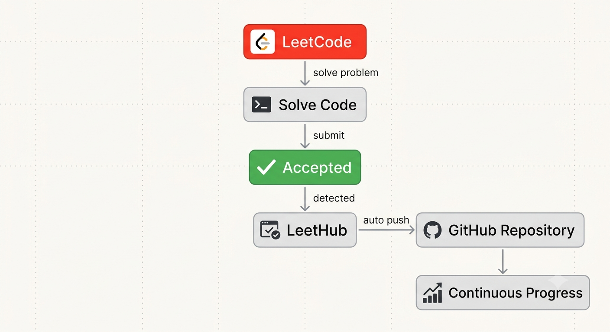

<!-- ═══════════════════════════════════════════════════════════════════════ -->
<!-- HERO / BANNER SECTION -->
<!-- ═══════════════════════════════════════════════════════════════════════ -->

<div align="center">
  


<br/>

<a href="https://github.com/harnoor8616/Getting_started_with_Data_Structures">
  
</a>

<br/><br/>


<br/><br/>


</div>

<br/>


<!-- ═══════════════════════════════════════════════════════════════════════ -->
<!-- ABOUT REPOSITORY -->
<!-- ═══════════════════════════════════════════════════════════════════════ -->

## 📖 About This Repository

<table align="center">
<tr>
<td>

This repository serves as a structured record of my journey through **Data Structures &amp; Algorithms** on **LeetCode**, built around a single philosophy: **master algorithmic patterns, not individual problems.** Rather than chasing problem counts, I focus on developing the ability to recognize recurring techniques, reason through unfamiliar challenges, and design efficient solutions from first principles.

- 🔄 **Automatic Synchronization** — Every accepted LeetCode submission is automatically synchronized to this repository through the **LeetHub** browser extension, ensuring that my progress is documented consistently without any manual intervention.

- 💠 **Modern C++** — All solutions are implemented in modern, standards-compliant **C++**, with an emphasis on clean architecture, readability, maintainability, and algorithmic efficiency.

- 🧩 **Pattern-Oriented Learning** — Problems are approached through a structured, pattern-based roadmap, allowing me to build transferable intuition across concepts such as Two Pointers, Sliding Window, Graph Traversal, Dynamic Programming, and many others.

- 🎯 **Understanding Before Optimization** — Every solution represents an effort to understand the underlying idea behind the algorithm, analyze trade-offs, and refine the approach, rather than simply arriving at an accepted submission.

- 📈 **A Living Record of Growth** — This repository reflects my commitment to consistent practice, disciplined learning, and continuous improvement as I prepare for technical interviews, competitive programming, and real-world software engineering challenges.
<div align="center">

> ### *"Every expert was once a beginner who refused to quit."*

</div>


<!-- ═══════════════════════════════════════════════════════════════════════ -->
<!-- REPOSITORY HIGHLIGHTS -->
<!-- ═══════════════════════════════════════════════════════════════════════ -->

## ✨ Repository Highlights

<div align="center">

| | | |
|:---:|:---:|:---:|
| 🔥 **Automatic Sync**<br/>with LeetHub | 💻 **Modern C++**<br/>solutions | 🧠 **Pattern-Based**<br/>learning |
| 🚀 **Interview**<br/>preparation | 📚 **Clean &amp; Readable**<br/>code | ⚡ **Optimized**<br/>approaches |
| 📈 **Continuous**<br/>learning | 🎯 **Consistency**<br/>driven | 🏆 **Public**<br/>archive |

</div>


<!-- ═══════════════════════════════════════════════════════════════════════ -->
<!-- PATTERN-BASED LEARNING ROADMAP -->
<!-- ═══════════════════════════════════════════════════════════════════════ -->

## 🗺️ Pattern-Based Learning Roadmap

<div align="center">
<sub>The roadmap below outlines the complete progression of patterns covered in this repository.</sub>
</div>

<br/>

<details open>
<summary><b>🟥 Foundations</b></summary>
<br/>

```
✔ Simulation / Implementation     ✔ Arrays            ✔ Strings
✔ Hashing                         ✔ Sorting           ✔ Binary Search
```

</details>

<details open>
<summary><b>⬛ Two-Pointer Family</b></summary>
<br/>

```
✔ Two Pointers     ✔ Sliding Window     ✔ Prefix Sum     ✔ Greedy
```

</details>

<details open>
<summary><b>🟥 Linear Data Structures</b></summary>
<br/>

```
✔ Stack             ✔ Queue              ✔ Linked List
✔ Monotonic Stack    ✔ Monotonic Queue
```

</details>

<details open>
<summary><b>⬛ Trees &amp; Hierarchical Structures</b></summary>
<br/>

```
✔ Trees     ✔ Binary Search Trees     ✔ Trie     ✔ Heap / Priority Queue
✔ Segment Tree     ✔ Fenwick Tree
```

</details>

<details open>
<summary><b>🟥 Graph Theory</b></summary>
<br/>

```
✔ Graph     ✔ DFS     ✔ BFS     ✔ Topological Sort
✔ Union Find     ✔ Advanced Graph Algorithms
```

</details>

<details open>
<summary><b>⬛ Recursive &amp; Combinatorial</b></summary>
<br/>

```
✔ Recursion     ✔ Backtracking     ✔ Dynamic Programming
```

</details>

<details open>
<summary><b>🟥 Specialized Patterns</b></summary>
<br/>

```
✔ Bit Manipulation     ✔ Matrix             ✔ Intervals
✔ Sweep Line           ✔ Binary Lifting     ✔ Number Theory
✔ Game Theory          ✔ Design Problems
```

</details>


<!-- ═══════════════════════════════════════════════════════════════════════ -->
<!-- LANGUAGES &amp; TOOLS -->
<!-- ═══════════════════════════════════════════════════════════════════════ -->

## 🛠️ Languages &amp; Tools

<div align="center">

**Primary Language**


<br/><br/>

**Future Support**


<br/><br/>


</div>


<!-- ═══════════════════════════════════════════════════════════════════════ -->
<!-- WORKFLOW -->
<!-- ═══════════════════════════════════════════════════════════════════════ -->

## ⚙️ Sync Workflow

<p align="center">
  
</p>


<!-- ═══════════════════════════════════════════════════════════════════════ -->
<!-- CODING PRINCIPLES -->
<!-- ═══════════════════════════════════════════════════════════════════════ -->

## 🧭 Coding Principles

<div align="center">

| Principle | Description |
|:---|:---|
| ✔️ **Clean Code** | Every solution favors clarity over cleverness |
| ✔️ **Readable Code** | Consistent naming, structure, and formatting |
| ✔️ **Standard C++** | Written using modern, idiomatic C++ practices |
| ✔️ **Efficient Algorithms** | Time and space complexity considered for every solution |
| ✔️ **Interview Ready** | Patterns are practiced the way they'd be explained live |
| ✔️ **Well Structured** | Organized by pattern, not by submission date |
| ✔️ **Optimized Solutions** | Brute-force first, then refined to optimal |

</div>


<!-- ═══════════════════════════════════════════════════════════════════════ -->
<!-- CONTACT ME -->
<!-- ═══════════════════════════════════════════════════════════════════════ -->

## 📬 Contact Me

<p align="center">
  <a href="https://mail.google.com/mail/?view=cm&amp;fs=1&amp;to=harnoorkaurdhiman@gmail.com" target="_blank">
    
  </a>

  <a href="https://instagram.com/harnoor_8616">
    
  </a>

  <a href="https://www.linkedin.com/in/harnoorkaurdhiman/">
    
  </a>

  <a href="https://leetcode.com/u/harnoor_8616/">
    
  </a>
</p>


<!-- ═══════════════════════════════════════════════════════════════════════ -->
<!-- QUOTE SECTION -->
<!-- ═══════════════════════════════════════════════════════════════════════ -->

<div align="center">

### 💭

> *"An algorithm must be seen to be believed."*
> **— Donald Knuth**

</div>

<!-- ═══════════════════════════════════════════════════════════════════════ -->
<!-- FOOTER -->
<!-- ═══════════════════════════════════════════════════════════════════════ -->


<div align="center">
<sub>⭐ If this repository helps you on your DSA journey, consider giving it a star.</sub>
</div>
<!---LeetCode Topics Start-->
# LeetCode Topics
## Math
|  |
| ------- |
| [0412-fizz-buzz](https://github.com/harnoor8616/Getting_started_with_Data_Structures/tree/master/0412-fizz-buzz) |
| [2235-add-two-integers](https://github.com/harnoor8616/Getting_started_with_Data_Structures/tree/master/2235-add-two-integers) |
## String
|  |
| ------- |
| [0412-fizz-buzz](https://github.com/harnoor8616/Getting_started_with_Data_Structures/tree/master/0412-fizz-buzz) |
| [2011-final-value-of-variable-after-performing-operations](https://github.com/harnoor8616/Getting_started_with_Data_Structures/tree/master/2011-final-value-of-variable-after-performing-operations) |
| [2114-maximum-number-of-words-found-in-sentences](https://github.com/harnoor8616/Getting_started_with_Data_Structures/tree/master/2114-maximum-number-of-words-found-in-sentences) |
| [2828-check-if-a-string-is-an-acronym-of-words](https://github.com/harnoor8616/Getting_started_with_Data_Structures/tree/master/2828-check-if-a-string-is-an-acronym-of-words) |
| [3110-score-of-a-string](https://github.com/harnoor8616/Getting_started_with_Data_Structures/tree/master/3110-score-of-a-string) |
## Simulation
|  |
| ------- |
| [0412-fizz-buzz](https://github.com/harnoor8616/Getting_started_with_Data_Structures/tree/master/0412-fizz-buzz) |
| [1920-build-array-from-permutation](https://github.com/harnoor8616/Getting_started_with_Data_Structures/tree/master/1920-build-array-from-permutation) |
| [1929-concatenation-of-array](https://github.com/harnoor8616/Getting_started_with_Data_Structures/tree/master/1929-concatenation-of-array) |
| [2011-final-value-of-variable-after-performing-operations](https://github.com/harnoor8616/Getting_started_with_Data_Structures/tree/master/2011-final-value-of-variable-after-performing-operations) |
## Array
|  |
| ------- |
| [1480-running-sum-of-1d-array](https://github.com/harnoor8616/Getting_started_with_Data_Structures/tree/master/1480-running-sum-of-1d-array) |
| [1672-richest-customer-wealth](https://github.com/harnoor8616/Getting_started_with_Data_Structures/tree/master/1672-richest-customer-wealth) |
| [1920-build-array-from-permutation](https://github.com/harnoor8616/Getting_started_with_Data_Structures/tree/master/1920-build-array-from-permutation) |
| [1929-concatenation-of-array](https://github.com/harnoor8616/Getting_started_with_Data_Structures/tree/master/1929-concatenation-of-array) |
| [2011-final-value-of-variable-after-performing-operations](https://github.com/harnoor8616/Getting_started_with_Data_Structures/tree/master/2011-final-value-of-variable-after-performing-operations) |
| [2114-maximum-number-of-words-found-in-sentences](https://github.com/harnoor8616/Getting_started_with_Data_Structures/tree/master/2114-maximum-number-of-words-found-in-sentences) |
| [2828-check-if-a-string-is-an-acronym-of-words](https://github.com/harnoor8616/Getting_started_with_Data_Structures/tree/master/2828-check-if-a-string-is-an-acronym-of-words) |
## Matrix
|  |
| ------- |
| [1672-richest-customer-wealth](https://github.com/harnoor8616/Getting_started_with_Data_Structures/tree/master/1672-richest-customer-wealth) |
## Prefix Sum
|  |
| ------- |
| [1480-running-sum-of-1d-array](https://github.com/harnoor8616/Getting_started_with_Data_Structures/tree/master/1480-running-sum-of-1d-array) |
<!---LeetCode Topics End-->
