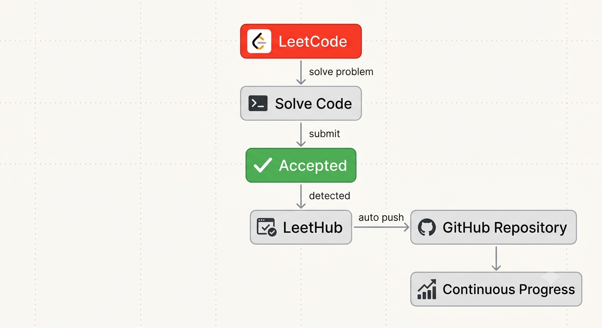

<!-- ═══════════════════════════════════════════════════════════════════════ -->
<!-- HERO / BANNER SECTION -->
<!-- ═══════════════════════════════════════════════════════════════════════ -->

<div align="center">
  


<br/>

<a href="https://github.com/harnoor8616/Getting_started_with_Data_Structures">
  
</a>

<br/><br/>


<br/><br/>


</div>

<br/>


<!-- ═══════════════════════════════════════════════════════════════════════ -->
<!-- ABOUT REPOSITORY -->
<!-- ═══════════════════════════════════════════════════════════════════════ -->

## 📖 About This Repository

<table align="center">
<tr>
<td>

This repository serves as a structured record of my journey through **Data Structures &amp; Algorithms** on **LeetCode**, built around a single philosophy: **master algorithmic patterns, not individual problems.** Rather than chasing problem counts, I focus on developing the ability to recognize recurring techniques, reason through unfamiliar challenges, and design efficient solutions from first principles.

- 🔄 **Automatic Synchronization** — Every accepted LeetCode submission is automatically synchronized to this repository through the **LeetHub** browser extension, ensuring that my progress is documented consistently without any manual intervention.

- 💠 **Modern C++** — All solutions are implemented in modern, standards-compliant **C++**, with an emphasis on clean architecture, readability, maintainability, and algorithmic efficiency.

- 🧩 **Pattern-Oriented Learning** — Problems are approached through a structured, pattern-based roadmap, allowing me to build transferable intuition across concepts such as Two Pointers, Sliding Window, Graph Traversal, Dynamic Programming, and many others.

- 🎯 **Understanding Before Optimization** — Every solution represents an effort to understand the underlying idea behind the algorithm, analyze trade-offs, and refine the approach, rather than simply arriving at an accepted submission.

- 📈 **A Living Record of Growth** — This repository reflects my commitment to consistent practice, disciplined learning, and continuous improvement as I prepare for technical interviews, competitive programming, and real-world software engineering challenges.
<div align="center">

> ### *"Every expert was once a beginner who refused to quit."*

</div>


<!-- ═══════════════════════════════════════════════════════════════════════ -->
<!-- REPOSITORY HIGHLIGHTS -->
<!-- ═══════════════════════════════════════════════════════════════════════ -->

## ✨ Repository Highlights

<div align="center">

| | | |
|:---:|:---:|:---:|
| 🔥 **Automatic Sync**<br/>with LeetHub | 💻 **Modern C++**<br/>solutions | 🧠 **Pattern-Based**<br/>learning |
| 🚀 **Interview**<br/>preparation | 📚 **Clean &amp; Readable**<br/>code | ⚡ **Optimized**<br/>approaches |
| 📈 **Continuous**<br/>learning | 🎯 **Consistency**<br/>driven | 🏆 **Public**<br/>archive |

</div>


<!-- ═══════════════════════════════════════════════════════════════════════ -->
<!-- PATTERN-BASED LEARNING ROADMAP -->
<!-- ═══════════════════════════════════════════════════════════════════════ -->

## 🗺️ Pattern-Based Learning Roadmap

<div align="center">
<sub>The roadmap below outlines the complete progression of patterns covered in this repository.</sub>
</div>

<br/>

<details open>
<summary><b>🟥 Foundations</b></summary>
<br/>

```
✔ Simulation / Implementation     ✔ Arrays            ✔ Strings
✔ Hashing                         ✔ Sorting           ✔ Binary Search
```

</details>

<details open>
<summary><b>⬛ Two-Pointer Family</b></summary>
<br/>

```
✔ Two Pointers     ✔ Sliding Window     ✔ Prefix Sum     ✔ Greedy
```

</details>

<details open>
<summary><b>🟥 Linear Data Structures</b></summary>
<br/>

```
✔ Stack             ✔ Queue              ✔ Linked List
✔ Monotonic Stack    ✔ Monotonic Queue
```

</details>

<details open>
<summary><b>⬛ Trees &amp; Hierarchical Structures</b></summary>
<br/>

```
✔ Trees     ✔ Binary Search Trees     ✔ Trie     ✔ Heap / Priority Queue
✔ Segment Tree     ✔ Fenwick Tree
```

</details>

<details open>
<summary><b>🟥 Graph Theory</b></summary>
<br/>

```
✔ Graph     ✔ DFS     ✔ BFS     ✔ Topological Sort
✔ Union Find     ✔ Advanced Graph Algorithms
```

</details>

<details open>
<summary><b>⬛ Recursive &amp; Combinatorial</b></summary>
<br/>

```
✔ Recursion     ✔ Backtracking     ✔ Dynamic Programming
```

</details>

<details open>
<summary><b>🟥 Specialized Patterns</b></summary>
<br/>

```
✔ Bit Manipulation     ✔ Matrix             ✔ Intervals
✔ Sweep Line           ✔ Binary Lifting     ✔ Number Theory
✔ Game Theory          ✔ Design Problems
```

</details>


<!-- ═══════════════════════════════════════════════════════════════════════ -->
<!-- LANGUAGES &amp; TOOLS -->
<!-- ═══════════════════════════════════════════════════════════════════════ -->

## 🛠️ Languages &amp; Tools

<div align="center">

**Primary Language**


<br/><br/>

**Future Support**


<br/><br/>


</div>


<!-- ═══════════════════════════════════════════════════════════════════════ -->
<!-- WORKFLOW -->
<!-- ═══════════════════════════════════════════════════════════════════════ -->

## ⚙️ Sync Workflow

<p align="center">
  
</p>


<!-- ═══════════════════════════════════════════════════════════════════════ -->
<!-- CODING PRINCIPLES -->
<!-- ═══════════════════════════════════════════════════════════════════════ -->

## 🧭 Coding Principles

<div align="center">

| Principle | Description |
|:---|:---|
| ✔️ **Clean Code** | Every solution favors clarity over cleverness |
| ✔️ **Readable Code** | Consistent naming, structure, and formatting |
| ✔️ **Standard C++** | Written using modern, idiomatic C++ practices |
| ✔️ **Efficient Algorithms** | Time and space complexity considered for every solution |
| ✔️ **Interview Ready** | Patterns are practiced the way they'd be explained live |
| ✔️ **Well Structured** | Organized by pattern, not by submission date |
| ✔️ **Optimized Solutions** | Brute-force first, then refined to optimal |

</div>


<!-- ═══════════════════════════════════════════════════════════════════════ -->
<!-- CONTACT ME -->
<!-- ═══════════════════════════════════════════════════════════════════════ -->

## 📬 Contact Me

<p align="center">
  <a href="https://mail.google.com/mail/?view=cm&amp;fs=1&amp;to=harnoorkaurdhiman@gmail.com" target="_blank">
    
  </a>

  <a href="https://instagram.com/harnoor_8616">
    
  </a>

  <a href="https://www.linkedin.com/in/harnoorkaurdhiman/">
    
  </a>

  <a href="https://leetcode.com/u/harnoor_8616/">
    
  </a>
</p>


<!-- ═══════════════════════════════════════════════════════════════════════ -->
<!-- QUOTE SECTION -->
<!-- ═══════════════════════════════════════════════════════════════════════ -->

<div align="center">

### 💭

> *"An algorithm must be seen to be believed."*
> **— Donald Knuth**

</div>

<!-- ═══════════════════════════════════════════════════════════════════════ -->
<!-- FOOTER -->
<!-- ═══════════════════════════════════════════════════════════════════════ -->


<div align="center">
<sub>⭐ If this repository helps you on your DSA journey, consider giving it a star.</sub>
</div>
<!---LeetCode Topics Start-->
# LeetCode Topics

## Math
|  |
| ------- |
| [0069-sqrtx](https://github.com/harnoor8616/Getting_started_with_Data_Structures/tree/master/0069-sqrtx) |
| [0202-happy-number](https://github.com/harnoor8616/Getting_started_with_Data_Structures/tree/master/0202-happy-number) |
| [0367-valid-perfect-square](https://github.com/harnoor8616/Getting_started_with_Data_Structures/tree/master/0367-valid-perfect-square) |
| [0412-fizz-buzz](https://github.com/harnoor8616/Getting_started_with_Data_Structures/tree/master/0412-fizz-buzz) |
| [0415-add-strings](https://github.com/harnoor8616/Getting_started_with_Data_Structures/tree/master/0415-add-strings) |
| [1041-robot-bounded-in-circle](https://github.com/harnoor8616/Getting_started_with_Data_Structures/tree/master/1041-robot-bounded-in-circle) |
| [2235-add-two-integers](https://github.com/harnoor8616/Getting_started_with_Data_Structures/tree/master/2235-add-two-integers) |
## String
|  |
| ------- |
| [0412-fizz-buzz](https://github.com/harnoor8616/Getting_started_with_Data_Structures/tree/master/0412-fizz-buzz) |
| [0415-add-strings](https://github.com/harnoor8616/Getting_started_with_Data_Structures/tree/master/0415-add-strings) |
| [0657-robot-return-to-origin](https://github.com/harnoor8616/Getting_started_with_Data_Structures/tree/master/0657-robot-return-to-origin) |
| [0844-backspace-string-compare](https://github.com/harnoor8616/Getting_started_with_Data_Structures/tree/master/0844-backspace-string-compare) |
| [1041-robot-bounded-in-circle](https://github.com/harnoor8616/Getting_started_with_Data_Structures/tree/master/1041-robot-bounded-in-circle) |
| [2011-final-value-of-variable-after-performing-operations](https://github.com/harnoor8616/Getting_started_with_Data_Structures/tree/master/2011-final-value-of-variable-after-performing-operations) |
| [2114-maximum-number-of-words-found-in-sentences](https://github.com/harnoor8616/Getting_started_with_Data_Structures/tree/master/2114-maximum-number-of-words-found-in-sentences) |
| [2785-sort-vowels-in-a-string](https://github.com/harnoor8616/Getting_started_with_Data_Structures/tree/master/2785-sort-vowels-in-a-string) |
| [2828-check-if-a-string-is-an-acronym-of-words](https://github.com/harnoor8616/Getting_started_with_Data_Structures/tree/master/2828-check-if-a-string-is-an-acronym-of-words) |
| [3110-score-of-a-string](https://github.com/harnoor8616/Getting_started_with_Data_Structures/tree/master/3110-score-of-a-string) |
## Simulation
|  |
| ------- |
| [0412-fizz-buzz](https://github.com/harnoor8616/Getting_started_with_Data_Structures/tree/master/0412-fizz-buzz) |
| [0415-add-strings](https://github.com/harnoor8616/Getting_started_with_Data_Structures/tree/master/0415-add-strings) |
| [0657-robot-return-to-origin](https://github.com/harnoor8616/Getting_started_with_Data_Structures/tree/master/0657-robot-return-to-origin) |
| [0682-baseball-game](https://github.com/harnoor8616/Getting_started_with_Data_Structures/tree/master/0682-baseball-game) |
| [0832-flipping-an-image](https://github.com/harnoor8616/Getting_started_with_Data_Structures/tree/master/0832-flipping-an-image) |
| [0844-backspace-string-compare](https://github.com/harnoor8616/Getting_started_with_Data_Structures/tree/master/0844-backspace-string-compare) |
| [1041-robot-bounded-in-circle](https://github.com/harnoor8616/Getting_started_with_Data_Structures/tree/master/1041-robot-bounded-in-circle) |
| [1920-build-array-from-permutation](https://github.com/harnoor8616/Getting_started_with_Data_Structures/tree/master/1920-build-array-from-permutation) |
| [1929-concatenation-of-array](https://github.com/harnoor8616/Getting_started_with_Data_Structures/tree/master/1929-concatenation-of-array) |
| [2011-final-value-of-variable-after-performing-operations](https://github.com/harnoor8616/Getting_started_with_Data_Structures/tree/master/2011-final-value-of-variable-after-performing-operations) |
## Array
|  |
| ------- |
| [0033-search-in-rotated-sorted-array](https://github.com/harnoor8616/Getting_started_with_Data_Structures/tree/master/0033-search-in-rotated-sorted-array) |
| [0034-find-first-and-last-position-of-element-in-sorted-array](https://github.com/harnoor8616/Getting_started_with_Data_Structures/tree/master/0034-find-first-and-last-position-of-element-in-sorted-array) |
| [0035-search-insert-position](https://github.com/harnoor8616/Getting_started_with_Data_Structures/tree/master/0035-search-insert-position) |
| [0036-valid-sudoku](https://github.com/harnoor8616/Getting_started_with_Data_Structures/tree/master/0036-valid-sudoku) |
| [0081-search-in-rotated-sorted-array-ii](https://github.com/harnoor8616/Getting_started_with_Data_Structures/tree/master/0081-search-in-rotated-sorted-array-ii) |
| [0118-pascals-triangle](https://github.com/harnoor8616/Getting_started_with_Data_Structures/tree/master/0118-pascals-triangle) |
| [0153-find-minimum-in-rotated-sorted-array](https://github.com/harnoor8616/Getting_started_with_Data_Structures/tree/master/0153-find-minimum-in-rotated-sorted-array) |
| [0154-find-minimum-in-rotated-sorted-array-ii](https://github.com/harnoor8616/Getting_started_with_Data_Structures/tree/master/0154-find-minimum-in-rotated-sorted-array-ii) |
| [0162-find-peak-element](https://github.com/harnoor8616/Getting_started_with_Data_Structures/tree/master/0162-find-peak-element) |
| [0414-third-maximum-number](https://github.com/harnoor8616/Getting_started_with_Data_Structures/tree/master/0414-third-maximum-number) |
| [0485-max-consecutive-ones](https://github.com/harnoor8616/Getting_started_with_Data_Structures/tree/master/0485-max-consecutive-ones) |
| [0682-baseball-game](https://github.com/harnoor8616/Getting_started_with_Data_Structures/tree/master/0682-baseball-game) |
| [0704-binary-search](https://github.com/harnoor8616/Getting_started_with_Data_Structures/tree/master/0704-binary-search) |
| [0744-find-smallest-letter-greater-than-target](https://github.com/harnoor8616/Getting_started_with_Data_Structures/tree/master/0744-find-smallest-letter-greater-than-target) |
| [0766-toeplitz-matrix](https://github.com/harnoor8616/Getting_started_with_Data_Structures/tree/master/0766-toeplitz-matrix) |
| [0832-flipping-an-image](https://github.com/harnoor8616/Getting_started_with_Data_Structures/tree/master/0832-flipping-an-image) |
| [0852-peak-index-in-a-mountain-array](https://github.com/harnoor8616/Getting_started_with_Data_Structures/tree/master/0852-peak-index-in-a-mountain-array) |
| [1480-running-sum-of-1d-array](https://github.com/harnoor8616/Getting_started_with_Data_Structures/tree/master/1480-running-sum-of-1d-array) |
| [1672-richest-customer-wealth](https://github.com/harnoor8616/Getting_started_with_Data_Structures/tree/master/1672-richest-customer-wealth) |
| [1920-build-array-from-permutation](https://github.com/harnoor8616/Getting_started_with_Data_Structures/tree/master/1920-build-array-from-permutation) |
| [1929-concatenation-of-array](https://github.com/harnoor8616/Getting_started_with_Data_Structures/tree/master/1929-concatenation-of-array) |
| [2011-final-value-of-variable-after-performing-operations](https://github.com/harnoor8616/Getting_started_with_Data_Structures/tree/master/2011-final-value-of-variable-after-performing-operations) |
| [2114-maximum-number-of-words-found-in-sentences](https://github.com/harnoor8616/Getting_started_with_Data_Structures/tree/master/2114-maximum-number-of-words-found-in-sentences) |
| [2828-check-if-a-string-is-an-acronym-of-words](https://github.com/harnoor8616/Getting_started_with_Data_Structures/tree/master/2828-check-if-a-string-is-an-acronym-of-words) |
## Matrix
|  |
| ------- |
| [0036-valid-sudoku](https://github.com/harnoor8616/Getting_started_with_Data_Structures/tree/master/0036-valid-sudoku) |
| [0766-toeplitz-matrix](https://github.com/harnoor8616/Getting_started_with_Data_Structures/tree/master/0766-toeplitz-matrix) |
| [0832-flipping-an-image](https://github.com/harnoor8616/Getting_started_with_Data_Structures/tree/master/0832-flipping-an-image) |
| [1672-richest-customer-wealth](https://github.com/harnoor8616/Getting_started_with_Data_Structures/tree/master/1672-richest-customer-wealth) |
## Prefix Sum
|  |
| ------- |
| [1480-running-sum-of-1d-array](https://github.com/harnoor8616/Getting_started_with_Data_Structures/tree/master/1480-running-sum-of-1d-array) |
## Stack
|  |
| ------- |
| [0682-baseball-game](https://github.com/harnoor8616/Getting_started_with_Data_Structures/tree/master/0682-baseball-game) |
| [0844-backspace-string-compare](https://github.com/harnoor8616/Getting_started_with_Data_Structures/tree/master/0844-backspace-string-compare) |
## Two Pointers
|  |
| ------- |
| [0202-happy-number](https://github.com/harnoor8616/Getting_started_with_Data_Structures/tree/master/0202-happy-number) |
| [0832-flipping-an-image](https://github.com/harnoor8616/Getting_started_with_Data_Structures/tree/master/0832-flipping-an-image) |
| [0844-backspace-string-compare](https://github.com/harnoor8616/Getting_started_with_Data_Structures/tree/master/0844-backspace-string-compare) |
## Bit Manipulation
|  |
| ------- |
| [0832-flipping-an-image](https://github.com/harnoor8616/Getting_started_with_Data_Structures/tree/master/0832-flipping-an-image) |
## Hash Table
|  |
| ------- |
| [0036-valid-sudoku](https://github.com/harnoor8616/Getting_started_with_Data_Structures/tree/master/0036-valid-sudoku) |
| [0202-happy-number](https://github.com/harnoor8616/Getting_started_with_Data_Structures/tree/master/0202-happy-number) |
## Dynamic Programming
|  |
| ------- |
| [0118-pascals-triangle](https://github.com/harnoor8616/Getting_started_with_Data_Structures/tree/master/0118-pascals-triangle) |
## Sorting
|  |
| ------- |
| [0414-third-maximum-number](https://github.com/harnoor8616/Getting_started_with_Data_Structures/tree/master/0414-third-maximum-number) |
| [2785-sort-vowels-in-a-string](https://github.com/harnoor8616/Getting_started_with_Data_Structures/tree/master/2785-sort-vowels-in-a-string) |
## Binary Search
|  |
| ------- |
| [0033-search-in-rotated-sorted-array](https://github.com/harnoor8616/Getting_started_with_Data_Structures/tree/master/0033-search-in-rotated-sorted-array) |
| [0034-find-first-and-last-position-of-element-in-sorted-array](https://github.com/harnoor8616/Getting_started_with_Data_Structures/tree/master/0034-find-first-and-last-position-of-element-in-sorted-array) |
| [0035-search-insert-position](https://github.com/harnoor8616/Getting_started_with_Data_Structures/tree/master/0035-search-insert-position) |
| [0069-sqrtx](https://github.com/harnoor8616/Getting_started_with_Data_Structures/tree/master/0069-sqrtx) |
| [0081-search-in-rotated-sorted-array-ii](https://github.com/harnoor8616/Getting_started_with_Data_Structures/tree/master/0081-search-in-rotated-sorted-array-ii) |
| [0153-find-minimum-in-rotated-sorted-array](https://github.com/harnoor8616/Getting_started_with_Data_Structures/tree/master/0153-find-minimum-in-rotated-sorted-array) |
| [0154-find-minimum-in-rotated-sorted-array-ii](https://github.com/harnoor8616/Getting_started_with_Data_Structures/tree/master/0154-find-minimum-in-rotated-sorted-array-ii) |
| [0162-find-peak-element](https://github.com/harnoor8616/Getting_started_with_Data_Structures/tree/master/0162-find-peak-element) |
| [0367-valid-perfect-square](https://github.com/harnoor8616/Getting_started_with_Data_Structures/tree/master/0367-valid-perfect-square) |
| [0704-binary-search](https://github.com/harnoor8616/Getting_started_with_Data_Structures/tree/master/0704-binary-search) |
| [0744-find-smallest-letter-greater-than-target](https://github.com/harnoor8616/Getting_started_with_Data_Structures/tree/master/0744-find-smallest-letter-greater-than-target) |
| [0852-peak-index-in-a-mountain-array](https://github.com/harnoor8616/Getting_started_with_Data_Structures/tree/master/0852-peak-index-in-a-mountain-array) |
<!---LeetCode Topics End-->

<!-- COMMITDSA_START -->
# DSA Portfolio

Welcome to my DSA solutions portfolio! This repository contains my solved problems on LeetCode and GeeksforGeeks, synchronized automatically using [CommitDSA](https://github.com/aprshubh/CommitDSA).

## Statistics

| Platform | Total Solved | Easy | Medium | Hard | Basic/School |
| --- | --- | --- | --- | --- | --- |
| LeetCode | 13 | 5 | 7 | 1 | - |
| GeeksforGeeks | 4 | 2 | 1 | 0 | 1 |
| **Total** | **17** | **7** | **8** | **1** | **1** |

## Solved Problems

| # | Problem | Platform | Difficulty | Language | Code |
| --- | --- | --- | --- | --- | --- |
| 1 | [35. Search Insert Position](https://leetcode.com/problems/search-insert-position/) | LeetCode | Easy | CPP | [Code](./LeetCode/Easy/35_SearchInsertPosition.cpp) |
| 2 | [367. Valid Perfect Square](https://leetcode.com/problems/valid-perfect-square/) | LeetCode | Easy | CPP | [Code](./LeetCode/Easy/367_ValidPerfectSquare.cpp) |
| 3 | [69. Sqrt(x)](https://leetcode.com/problems/sqrtx/) | LeetCode | Easy | CPP | [Code](./LeetCode/Easy/69_Sqrtx.cpp) |
| 4 | [704. Binary Search](https://leetcode.com/problems/binary-search/) | LeetCode | Easy | CPP | [Code](./LeetCode/Easy/704_BinarySearch.cpp) |
| 5 | [744. Find Smallest Letter Greater Than Target](https://leetcode.com/problems/find-smallest-letter-greater-than-target/) | LeetCode | Easy | CPP | [Code](./LeetCode/Easy/744_FindSmallestLetterGreaterThanTarget.cpp) |
| 6 | [153. Find Minimum in Rotated Sorted Array](https://leetcode.com/problems/find-minimum-in-rotated-sorted-array/) | LeetCode | Medium | CPP | [Code](./LeetCode/Medium/153_FindMinimumInRotatedSortedArray.cpp) |
| 7 | [162. Find Peak Element](https://leetcode.com/problems/find-peak-element/) | LeetCode | Medium | CPP | [Code](./LeetCode/Medium/162_FindPeakElement.cpp) |
| 8 | [2785. Sort Vowels in a String](https://leetcode.com/problems/sort-vowels-in-a-string/) | LeetCode | Medium | CPP | [Code](./LeetCode/Medium/2785_SortVowelsInAString.cpp) |
| 9 | [33. Search in Rotated Sorted Array](https://leetcode.com/problems/search-in-rotated-sorted-array/) | LeetCode | Medium | CPP | [Code](./LeetCode/Medium/33_SearchInRotatedSortedArray.cpp) |
| 10 | [34. Find First and Last Position of Element in Sorted Array](https://leetcode.com/problems/find-first-and-last-position-of-element-in-sorted-array/) | LeetCode | Medium | CPP | [Code](./LeetCode/Medium/34_FindFirstAndLastPositionOfElementInSortedArray.cpp) |
| 11 | [81. Search in Rotated Sorted Array II](https://leetcode.com/problems/search-in-rotated-sorted-array-ii/) | LeetCode | Medium | CPP | [Code](./LeetCode/Medium/81_SearchInRotatedSortedArrayII.cpp) |
| 12 | [852. Peak Index in a Mountain Array](https://leetcode.com/problems/peak-index-in-a-mountain-array/) | LeetCode | Medium | CPP | [Code](./LeetCode/Medium/852_PeakIndexInAMountainArray.cpp) |
| 13 | [154. Find Minimum in Rotated Sorted Array II](https://leetcode.com/problems/find-minimum-in-rotated-sorted-array-ii/) | LeetCode | Hard | CPP | [Code](./LeetCode/Hard/154_FindMinimumInRotatedSortedArrayII.cpp) |
| 14 | [Count the Zeros](https://practice.geeksforgeeks.org/problems/count-the-zeros2550/1) | GeeksforGeeks | Easy | C_CPP | [Code](./GFG/Easy/0_CountTheZeros.cpp) |
| 15 | [Number of occurrence](https://practice.geeksforgeeks.org/problems/number-of-occurrence2259/1) | GeeksforGeeks | Easy | C_CPP | [Code](./GFG/Easy/0_NumberOfOccurrence.cpp) |
| 16 | [Minimum Swaps to Sort](https://practice.geeksforgeeks.org/problems/minimum-swaps/1) | GeeksforGeeks | Medium | C_CPP | [Code](./GFG/Medium/0_MinimumSwapsToSort.cpp) |
| 17 | [Cube Root](https://practice.geeksforgeeks.org/problems/cube-root-of-a-number0915/1) | GeeksforGeeks | Basic | C_CPP | [Code](./GFG/Basic/0_CubeRoot.cpp) |
<!-- COMMITDSA_END -->

| # | Problem | Platform | Difficulty | Date Solved | Time |
|---|---------|----------|------------|-------------|------|
| 18 | [BFS of graph](./GeeksForGeeks/Easy/BFS%20of%20graph) | [GeeksForGeeks](https://www.geeksforgeeks.org/problems/bfs-traversal-of-graph/1) | Easy | 14 Aug 2026 | 05:23 pm |
| 19 | [Indexes of Subarray Sum](./GeeksForGeeks/Medium/Indexes%20of%20Subarray%20Sum) | [GeeksForGeeks](https://www.geeksforgeeks.org/problems/subarray-with-given-sum-1587115621/1?page=1&category=Arrays&sortBy=submissions) | Medium | 14 Aug 2026 | 11:07 pm |
